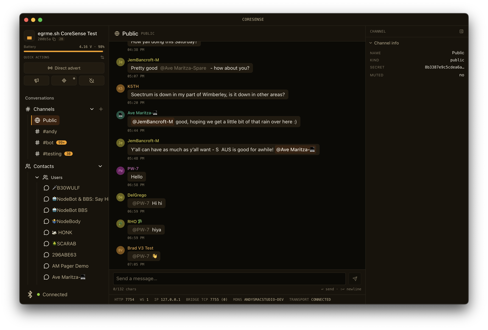

# coresense

CoreSense is an experimental desktop MeshCore client. It borrows some ideas from [MeshSense](https://github.com/Affirmatech/MeshSense) but for MeshCore.

## Vibe Coded Warning

This app is mostly written with help from Claude. While I make efforts to ensure the implemented features work consider this your AI warning. Her ebe dragons!

## Features

We aim to have feature parity with the mobile applications. But in addition there are some ideas I wanted to try out:

* Command palette for navigation and actions (similar to Discord, Slack, VS Code). It's an application navigation I generally like and think it could work well for a MeshCore client. Use <kbd>⌘</kbd>+<kbd>K</kbd> on macOS or <kbd>^</kbd>+<kbd>K</kbd> Windows.
* TCP device proxy for conencting to your device from an official mobile client through CoreSense. CoreSense holds the connection to your device while still allowing you to connect via mobile TCP when you walk away from the desktop.
* Quick-reply messages with custom macros. Allowing you to add strings like paths, hop counts, RSSI, SNR, and other data that can be extracted from messages to replies easily.
* Firmware management tools for backup and upgrading right in app so you don't need to pull up a browser or separate tool.